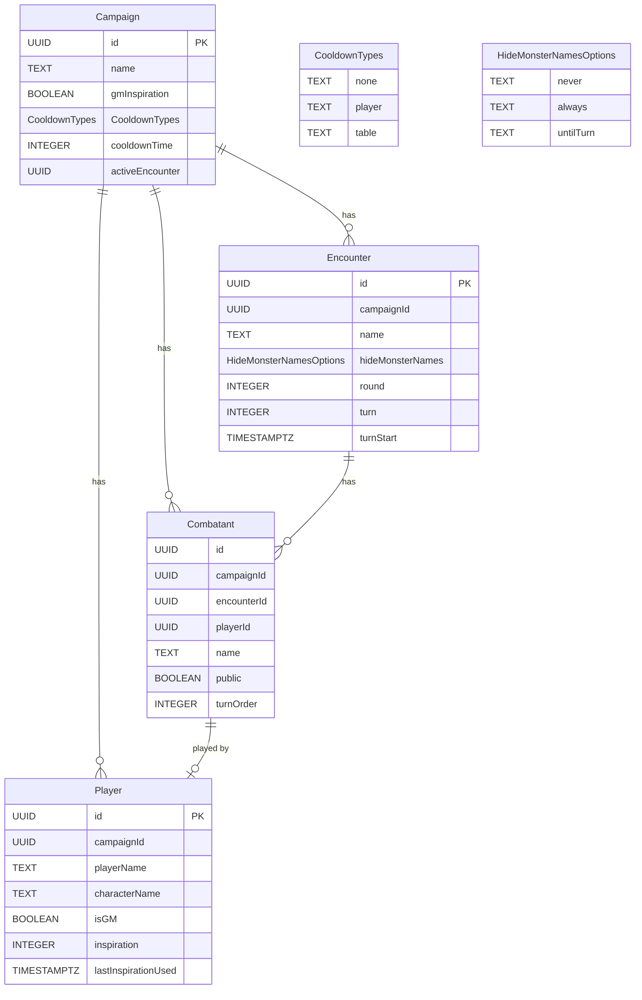

# OBS GM Overlay

A simple web application, designed to be run locally by a GM in-session, which
generates some simple OBS overlays to impose over your Discord camera.

Designed to help GMs present information to the players to avoid the inevitable
questions of "when is my turn" or "do I have inspiration?"

## Database

The app has been refactored to prepare it to run as a local executable using Node's [Single Executable Applications](https://nodejs.org/api/single-executable-applications.html) feature. To that end, the entire database has been replaced with a sqlite file located in the user's app data directory. The Node 24 integrated sqlite client was used to avoid any dependency issues with an additional sqlite needing to be installed.

## Database Schema ER Diagram

## To Do

### MVP

- [x] Initial web app config
- [x] Initial server app config
- [x] Initial database config
- [x] Configure Campaign types/queries/mutations
- [x] Configure Player types/queries/mutations
- [x] Enable subscription support/add campaign subscription
- [x] Campaigns Page
  - [x] List campaigns
- [x] Campaign Editor
  - [x] Query and show campaign data
  - [x] Allow editing campaign data
  - [x] Allow adding campaign
  - [x] Allow deleting campaign
  - [x] List player data
  - [x] Allow editing player data
  - [x] Allow adding player
  - [x] Allow deleting player
- [x] Campaign Overlay
  - [x] Query/display player data
  - [x] Update player data on update using subscription
  - [x] Style player data suitable for OBS overlay
- [ ] Inspiration Tracker
  - [x] Allow updating player inspiration count
  - [ ] Allow GM to disable multiple-inspiration (i.e. inspiration is either on or off)
  - [ ] Allow GM to configure max. inspiration value
  - [x] Track last inspiration consumption time
  - [x] Limit consumption of inspiration by a configurable cooldown window
  - [x] Allow GM to specify a cooldown time in minutes
  - [x] Allow GM to specify whether cooldown is per player or for the entire group
  - [x] Allow GM to reset cooldown for specific players
  - [ ] Allow GM to reset cooldown for entire table
- [ ] Initiative Tracker
  - [x] Allow GM to add combatants with public/private names
  - [x] Allow GM to set combatant initiative order
  - [x] Allow GM to add multiple encounters, each with its own initiative tracking, and set one as active
  - [x] Allow GM to unset active encounter (leaving encounter in list, but just making not active at this time)
  - [x] Allow GM to reset encounter initiative (set round/turn back to 0/0)
  - [x] Allow GM to advance initiative forward/backward by one turn
  - [x] Create initiative overlay that tracks whose turn it is/how many rounds have passed
  - [ ] Allow GM to specify cooldown duration in rounds
  - [ ] Add optional alternative (MCDM) inspiration mode (teams go together and decide order on each turn)
  - [ ] Add option to disable a combatant temporarily (e.g. the player is downed or incapacitated, the monster is dead); shows the combatant name with strikethrough effect
  - [ ] Add initiative bonus to campaign editor + initiative editor, auto-roll initiative
- [x] Production
  - [x] Host DB on AWS RDS (free tier)
  - [x] Host app on AWS EC2 (free tier)
  - [x] Create CI/CD pipeline
- [ ] Hardening
  - [x] Automatic GQL type generation
    - [x] Use generated types in web
    - [x] Use generated types in server (requires custom mappers)
  - [x] Better eslint/prettier/typecheck/build config
  - [x] Lint/format pre-commit hook
  - [ ] General refactor pass to get components standardized/DRY/split to enforce separation of concerns
  - [x] Generate and run production server builds
  - [x] Explore possibility of integrating server app into next.js API routing
    - [x] Auto-initialize WS server on server startup (currently have to run an HTTP request to initialize it first)
    - [x] Fix hot-reloading of server modules
  - [x] Switch to another DB implementation (sqlite is not cutting it, migrations are a nightmare)
    - [x] Change all IDs to no longer be incremental (e.g. GUIDs generated at resource creation)
    - [x] REVERTED: Switched back to sqlite to prepare the app to be run as a local application (no more server hosting fees or user auth!)
  - [ ] Single Executable Application
    - [x] Upgrade all package dependencies
    - [x] Update to Node 24+
    - [x] Gut postgres/migrations in favor of a single SQL database with a simpler schema
    - [ ] Hardening pass on database clients (first pass was quick but shoddy)
    - [ ] Fix broken styles brought about by the MUI update
    - [x] Remove unused packages/general treeshaking to get overall bundle size down
    - [x] Figure out a way to bundle Next.js build output to a single .js file
    - [x] First .exe build
